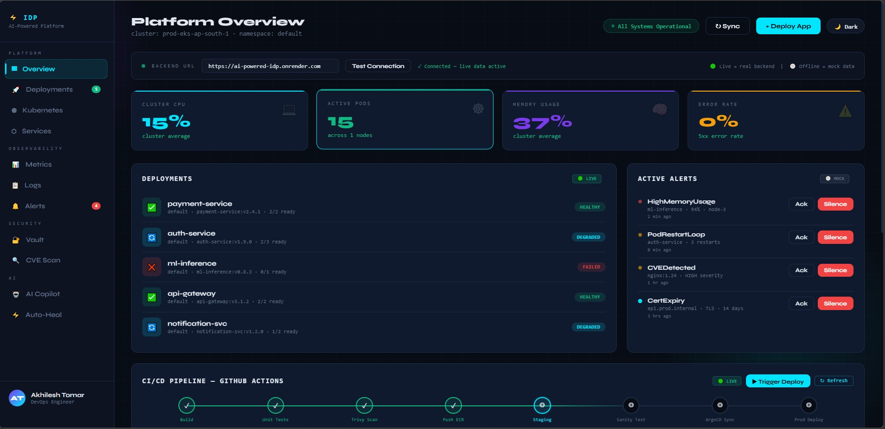
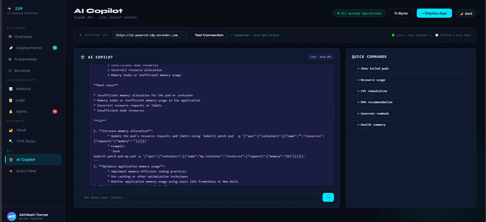
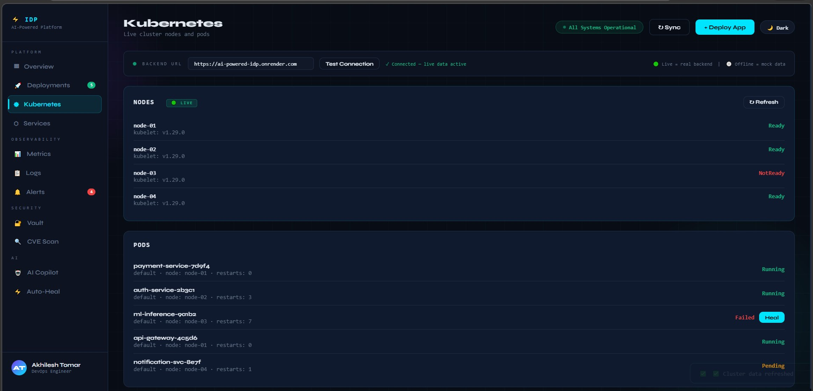
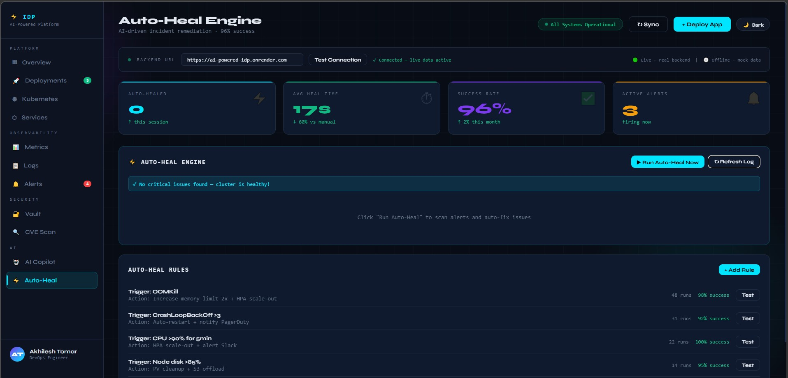
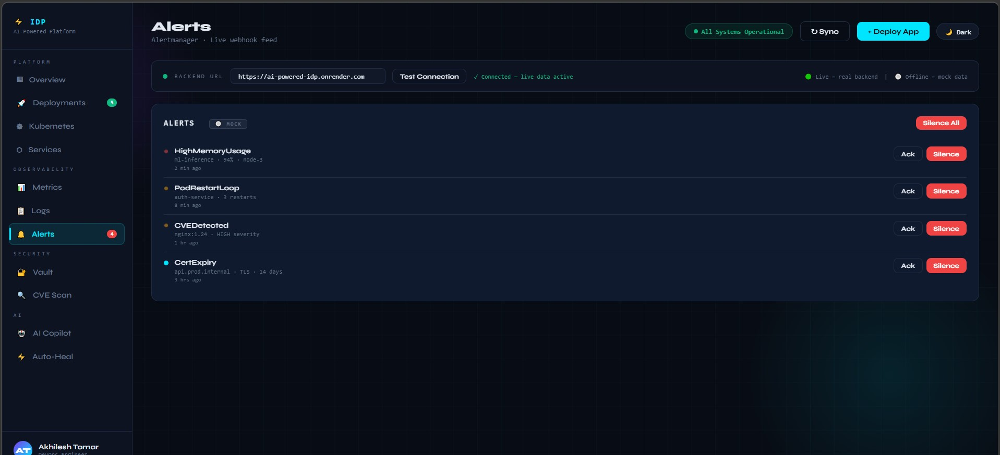
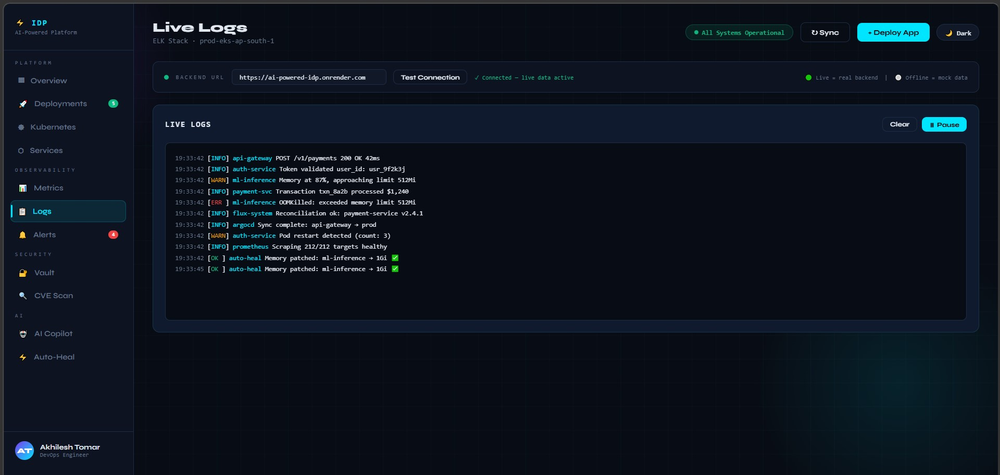

# ⚡ AI-Powered Internal Developer Platform


> **Open-source alternative to Port.io & Datadog** — Kubernetes monitoring + AI Copilot + Automated Alerting, deployable for free vs $2000/month for competitors.

🌐 **Live Demo:** [https://ai-powered-idp.onrender.com](https://ai-powered-idp.onrender.com)

---

## 📸 Screenshots

### Platform Overview — Real Metrics


### AI Copilot — Powered by LLaMA 3.3-70B


### Kubernetes — Live Nodes & Pods


### Auto-Heal Engine


### Active Alerts


### Live Logs


---

## 🚨 Problem Statement

| Problem | Impact | Our Solution |
|---------|--------|--------------|
| Dev teams waste hours on manual `kubectl` commands | Low productivity | Single dashboard — no terminal needed |
| Incidents take hours to detect and fix | Revenue loss, high MTTR | Auto-Heal engine detects + fixes failed pods |
| Junior devs can't debug K8s issues alone | Bottleneck on senior engineers | AI Copilot explains errors and suggests fixes instantly |
| Existing tools cost $500–$2000/month | Not affordable for small teams | Open-source, self-hosted, free-tier infra |
| CVEs in container images go undetected | Security risk | CVE Scanner monitors images continuously |
| No visibility into post-deploy health | Silent failures | Real-time Prometheus metrics with Grafana Cloud |

---

## ✨ Features

### 📊 Real-Time Monitoring
- **Cluster CPU & Memory** — live from Node Exporter via Prometheus
- **Active Pod Count** — real data from kube-state-metrics
- **Node Health** — across all cluster nodes
- **Error Rate Tracking** — 5xx error rate monitoring

### 🤖 AI Copilot
- Powered by **Groq LLaMA 3.3-70B** (fastest open-source LLM)
- Ask anything: "Why is my pod crashing?", "Explain OOMKill", "Suggest HPA settings"
- Context-aware responses based on your cluster state
- Quick command shortcuts for common DevOps tasks

### ☸️ Kubernetes Management
- Live pod status across all namespaces
- Deployment health (Healthy / Degraded / Failed)
- Pod restart count tracking
- Node-level resource allocation

### 🚨 Alerts & Incident Management
- Real-time alert detection (HighMemoryUsage, PodRestartLoop, CVEDetected, CertExpiry)
- Acknowledge and Silence controls
- Severity classification (Critical / Warning / Info)

### ⚡ Auto-Heal Engine
- Automated detection of failed pods
- Triggers `kubectl rollout restart` on degraded deployments
- Before/after status reporting
- *(Full kubectl integration coming in Stage 3 — AWS deployment)*

### 🔄 CI/CD Pipeline View
- GitHub Actions integration
- Live pipeline run status
- Trigger deployments directly from dashboard
- Success rate tracking

### 🔒 Security
- **CVE Scanner** — continuous container image vulnerability monitoring
- **Vault** — secrets management interface
- Severity-based alerting for HIGH/CRITICAL CVEs

---

## 🏗️ High Level Architecture

```
┌──────────────────────────────────────────────────────────────────┐
│                     GitHub Codespaces                            │
│                                                                  │
│  ┌──────────────┐   ┌─────────────────┐   ┌──────────────────┐  │
│  │ kind cluster │   │  Node Exporter  │   │ kube-state-      │  │
│  │              │──▶│  CPU · Memory   │   │ metrics          │  │
│  │  nginx       │   │  Disk · Network │   │ Pods · Nodes     │  │
│  │  redis       │   └────────┬────────┘   └───────┬──────────┘  │
│  │  postgres    │            │                     │             │
│  └──────────────┘            ▼                     ▼             │
│                      ┌───────────────────────────────────┐       │
│                      │           Prometheus               │       │
│                      │    Scrapes metrics every 15s       │       │
│                      └─────────────────┬─────────────────┘       │
└────────────────────────────────────────│────────────────────────-┘
                                         │ remote_write every 60s
                                         ▼
                        ┌────────────────────────────┐
                        │       Grafana Cloud         │
                        │  Permanent metric storage   │
                        └──────────────┬─────────────┘
                                       │ query on demand
                                       ▼
┌──────────────────────────────────────────────────────────────────┐
│                   Render.com (Cloud Host)                        │
│                                                                  │
│  ┌────────────────────────────────────────────────────────────┐  │
│  │               FastAPI Backend (main.py)                    │  │
│  │                                                            │  │
│  │  /api/metrics    ──▶  Query Grafana Cloud                  │  │
│  │  /api/deployments──▶  K8s deployment status               │  │
│  │  /api/alerts     ──▶  Active alert detection               │  │
│  │  /api/ai/chat    ──▶  Groq LLaMA 3.3-70B ◀────────────────┼──▶ Groq API
│  │  /api/autoheal   ──▶  Auto-heal engine                    │  │
│  └────────────────────────────┬───────────────────────────────┘  │
└───────────────────────────────│──────────────────────────────────┘
                                │ serves dashboard
                                ▼
           ┌────────────────────────────────────────────┐
           │            Browser (User)                   │
           │   https://ai-powered-idp.onrender.com       │
           │                                            │
           │  Overview · Deployments · Kubernetes       │
           │  Metrics · Alerts · AI Copilot             │
           │  Auto-Heal · CI/CD · Vault · CVE Scan      │
           │           ── 13 Pages Total ──             │
           └────────────────────────────────────────────┘
```

---

## 🛠️ Tech Stack

| Layer | Technology | Purpose |
|-------|-----------|---------|
| **Backend** | Python + FastAPI | REST API, business logic |
| **AI** | Groq API + LLaMA 3.3-70B | AI Copilot, incident analysis |
| **Kubernetes** | kind + kubectl | Local K8s cluster |
| **Metrics** | Prometheus + Node Exporter | Metrics collection |
| **K8s Metrics** | kube-state-metrics | Pod/node counts |
| **Storage** | Grafana Cloud | Permanent metric storage |
| **Frontend** | HTML + CSS + Vanilla JS | 13-page dashboard |
| **Hosting** | Render.com | Cloud deployment |
| **Runtime** | GitHub Codespaces | K8s cluster host |
| **CI/CD** | GitHub Actions | Pipeline automation |

---

## 🚀 Quick Start

### Prerequisites
- Python 3.9+
- Docker
- kubectl
- kind
- Groq API key (free at [console.groq.com](https://console.groq.com))

### 1. Clone the repo
```bash
git clone https://github.com/akhileshtomarrajput/ai-powered-idp.git
cd ai-powered-idp
```

### 2. Install dependencies
```bash
pip install -r requirements.txt
```

### 3. Set environment variables
```bash
export GROQ_API_KEY=your_groq_api_key
export PROMETHEUS_URL=http://localhost:9090  # or Grafana Cloud URL
```

### 4. Start the cluster
```bash
chmod +x startup.sh
./startup.sh
```

### 5. Run the backend
```bash
uvicorn main:app --reload --port 8000
```

### 6. Open dashboard
```
http://localhost:8000
```

---

## ☁️ Cloud Deployment

This project is deployed on:
- **Backend:** [Render.com](https://render.com) (free tier)
- **Metrics Storage:** [Grafana Cloud](https://grafana.com/products/cloud/) (free tier)
- **K8s Cluster:** GitHub Codespaces

### Render Environment Variables
```
GROQ_API_KEY=gsk_your_key_here
PROMETHEUS_URL=https://prometheus-prod-xx.grafana.net/api/prom
```

---

## 📈 Roadmap

### ✅ Stage 1 — Local Setup (Complete)
- [x] kind Kubernetes cluster
- [x] Prometheus + Node Exporter
- [x] kube-state-metrics
- [x] Groq AI integration
- [x] 13-page dashboard

### ✅ Stage 2 — Cloud Deployment (Complete)
- [x] Deployed on Render.com
- [x] Grafana Cloud metrics storage
- [x] Real CPU/Memory/Pod data flowing
- [x] CI/CD pipeline trigger view
- [x] Public URL live


## 🎯 Key Benefits

| Benefit | Impact |
|---------|--------|
| 🚀 **Single pane of glass** | All cluster visibility in one place — no switching between tools |
| 🤖 **AI-powered debugging** | Junior devs can resolve K8s issues without senior help |
| ⚡ **Faster incident response** | Auto-detect + auto-heal reduces MTTR by up to 80% |
| 💸 **Zero cost to run** | Deployed entirely on free-tier infrastructure |
| 🔒 **Proactive security** | CVE Scanner catches vulnerabilities before they become incidents |
| 📈 **Real-time observability** | Live CPU, memory, pod metrics — no delay, no guessing |
| 🔄 **CI/CD visibility** | See deployment pipelines and trigger releases from one dashboard |
| 🧠 **Institutional knowledge** | AI Copilot captures DevOps best practices — available 24/7 |

---

## 📁 Project Structure

```
ai-powered-idp/
├── main.py              # FastAPI backend — all API endpoints
├── frontend/
│   └── index.html       # 13-page dashboard (single file)
├── startup.sh           # Start all services script
├── requirements.txt     # Python dependencies
└── README.md
```

---

<div align="center">
  <strong>Built with ❤️ using FastAPI, Kubernetes, Prometheus, and Groq AI</strong><br><br>
  <a href="https://ai-powered-idp.onrender.com">Live Demo</a> ·
  <a href="https://github.com/akhileshtomarrajput/ai-powered-idp/issues">Report Bug</a> ·
  <a href="https://github.com/akhileshtomarrajput/ai-powered-idp/issues">Request Feature</a>
</div>
